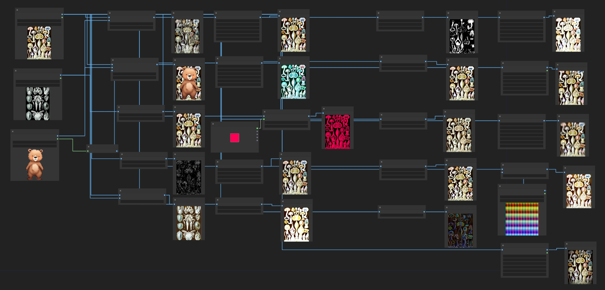

#  ComfyUI-MX-post-processing-nodes

A collection of post processing nodes for [ComfyUI](https://github.com/comfyanonymous/ComfyUI),which adds image post-processing adjustment capabilities to the ComfyUI.

## Example Image and Workflow

  
 

---

	
$\Large\color{#00A7B5}\text{Expand Node List}$

 

 - MX_Blend: Blends two images using arithmetic operations like add,multiply, overlay, darken,lighten.......
 - MX_AlphaBlend: Blends two images alpha mask
 - MX_Blur: Applies a Gaussian blur to the input image, softening the details
 - MX_Canny: Creates a mask using canny edge detection  
 - MX_Color:Matchs color from another image  
 - MX_Chromatic Aberration: Shifts the color channels in an image, creating a glitch aesthetic
 - MX_ColorCorrect: Adjusts the color balance, temperature, hue, brightness, contrast, saturation, and gamma of an image
 - MX_ColorTint: Applies a customizable tint to the input image, with various color modes such as sepia, RGB, CMY and several composite colors
 - MX_Noise:Adds noise to image  
 - MX_Glow: Applies a blur with a specified radius and then blends it with the original image. Creates a nice glowing effect.
 - MX_HSVThresholdMask: Creates a mask by thresholding HSV (hue, saturation, and value) channels
 - MX_KuwaharaBlur(Cartoon):Applies an edge preserving blur, creating a more realistic blur than Gaussian.
 - MX_Pixelize: Applies a pixelization effect, simulating the reducing of resolution
 - MX_Posterize: Set and dither the amount of colors in an image from 0-256, reducing color information
 - MX_Sharpen: Enhances the details in an image by applying a sharpening filter
 - MX_SineWave: Runs a sine wave through the image, making it appear squiggly
 - MX_Solarize: Inverts image colors based on a threshold for a striking, high-contrast effect
 - MX_LensBokeh: LensBokeh effect  
 - MX_LensOpticAxis: LensOpticAxis effect  
 - MX_LensZoomBurst: LensZoomBurst effect  
 - MX_LUT: Adds LUT to image  
 - MX_Vignette: Applies a vignette effect, putting the corners of the image in shadow

---

## Install

To install these nodes 

  - Navigate to your `/ComfyUI/custom_nodes/` folder
  - Run `git clone https://github.com/Intersection98/MX-ComfyUI-post-processing-nodes/`
  - pip install -r requirements.txt

## Reference
  https://github.com/EllangoK/ComfyUI-post-processing-nodes/  
  https://github.com/digitaljohn/comfyui-propost  
  https://github.com/shadowcz007/comfyui-mixlab-nodes  
